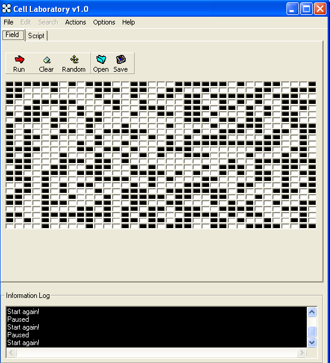



## Scriptable Cellular Automata

### Description

This is the source code of the Program CellLab. The program is an experimentation toolkit for a 2D cellular automata. Cell Laboratory basically separates the rules and the field where action is happening. It offers customizable rule and field system. It means, a user is able to run the cellular automata using any of him custom rule. This program offers Save/Open functionality for both rules and field.

Learn more about Cellular Automata by clicking at the links below:

http://www.colorado.edu/physics/pion/srr/catutorial/

http://parallel.hpc.unsw.edu.au/complex/tutorials/tutorial1.html

PLEASE VOTE!!! If you like the program..

Visit program homepage at: http://naramcheez.paraschopra.com/celllab/index.php
 
### More Info
 

             |
---                |---
**Submitted On**   |2005-09-10 21:59:14
**By**             |[Paras Chopra](https://github.com/Planet-Source-Code/PSCIndex/blob/master/ByAuthor/paras-chopra.md)
**Level**          |Intermediate
**User Rating**    |3.7 (11 globes from 3 users)
**Compatibility**  |VB 5\.0, VB 6\.0
**Category**       |[Miscellaneous](https://github.com/Planet-Source-Code/PSCIndex/blob/master/ByCategory/miscellaneous__1-1.md)
**World**          |[Visual Basic](https://github.com/Planet-Source-Code/PSCIndex/blob/master/ByWorld/visual-basic.md)
**Archive File**   |[Scriptable1932309132005\.zip](https://github.com/Planet-Source-Code/paras-chopra-scriptable-cellular-automata__1-62551/archive/master.zip)

